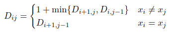

# Interval dynamic programming in C
Pages 22 to 26 inclusive: https://web.stanford.edu/class/cs97si/04-dynamic-programming.pdf

Finding the number least insertions needed to form a palindrome.

Implementing expression:



Some code taken from https://www.geeksforgeeks.org/minimum-insertions-to-form-a-palindrome-dp-28/

## Compiling and running
To compile, simply call make inside the directory. This will compile both programs.
```
make
```

And then run from console:
```
./recursive-palindrome inputString
```
and
```
./dp-palindrome inputString
```
### Cleaning
Make is configured to remove all compiled programs.
```
make clean
```